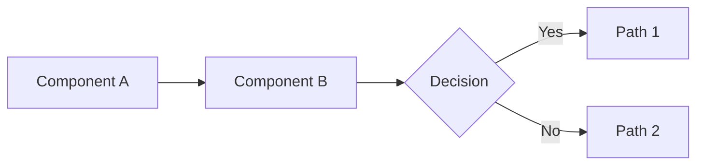
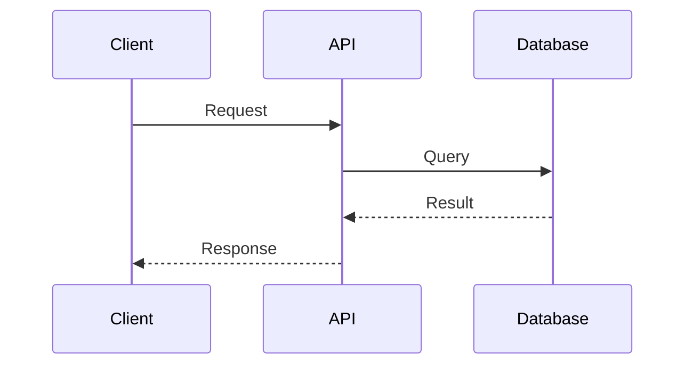
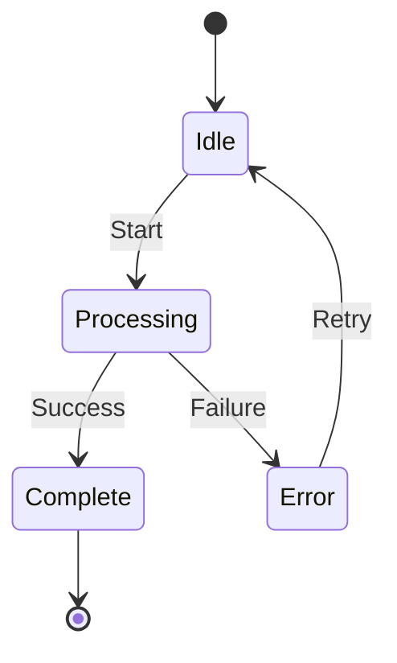

# Visualization Helper

## Purpose
Guide selection of the right visualization type for each kind of information.

## Selection Guide

| Information Type | Best Visualization | When to Use |
|------------------|-------------------|-------------|
| System architecture | Mermaid `graph` | Component relationships, data flow |
| Request flow | Mermaid `sequenceDiagram` | Time-ordered interactions between components |
| State changes | Mermaid `stateDiagram-v2` | Workflow states, process lifecycle |
| Alternatives | Comparison table | Approach pros/cons, feature matrices |
| Metrics | Metrics table | Before/after benchmarks, goal tracking |
| Simple change | ASCII diagram | Quick before/after, when Mermaid is overkill |

## Examples

### Mermaid Graph (Architecture)


### Mermaid Sequence (Request Flow)


### Mermaid State (Lifecycle)


### Comparison Table
```markdown
| Approach | Pros | Cons | Complexity | Chosen |
|----------|------|------|------------|--------|
| Option A | Fast, simple | Not distributed | Low | |
| Option B | Distributed, resilient | Extra service | Medium | Selected |
```

### Metrics Table
```markdown
| Metric | Before | After | Change | Target |
|--------|--------|-------|--------|--------|
| Response time | 340ms | 28ms | -92% | <50ms |
| Memory | 120MB | 135MB | +12% | <200MB |
```
